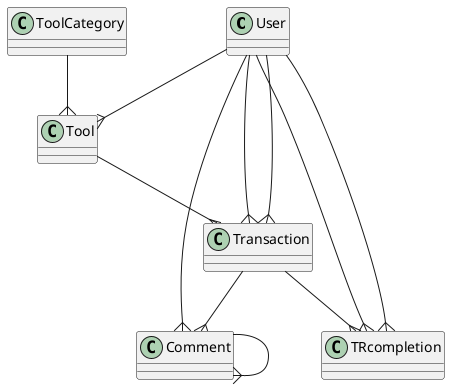
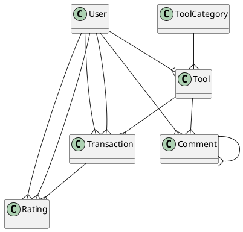

# TTZC0800 (Tietokannat) kurssin Harjoitustyö

## Työkalujenlainauspalvelu (Über for tools)

* "iTool"-tietokanta
* Työryhmä: 
    1. Samson Azizyan (M3156)
    2. Joel Aalto (M2113)
    3. Jaber Askari (M2947)
* Versio 0.1 9.4.2019

# Sisällysluettelo

* [Vaatimusmäärittely](#vaatimusmäärittely)
    * [Johdanto](#johdanto)
    * [Yleiskuvaus](#yleiskuvaus)
    * [Toiminnot](#toiminnot)
    * [Ulkoiset liittymät](#ulkoiset-liittymät)
    * [Muut ominaisuudet](#muut-ominaisuudet)
* [Käsitemalli](#käsitemalli)
* [Relaatiokaavio](#relaatiokaavio)
* [Käyttöliittymä](#käyttöliittymä)
* [Selostus](#selostus)
* [Itsearviot](#itsearviot)
* [Linkit](#linkit)

# Vaatimusmäärittely

## Johdanto

Tietokanta tehdään työkalulainaussovellusta varten, tietokannat kurssin (TTZO0800) harjoitustyöhön. Yrittäjyys-tunnilla piti väkisin keksiä ideoita palvelua (sovellusta) varten. Voitetiin meidän iTool idealla huulirasvat.
Tarkoitus on tehdä tietokantaratkaisun hiekkalaatikossa toimivaa sovellusta varten. Tietokannan toteuttaa opiskelija Samson Azizyan, Jaber Askari ja Joel Aalto. Samson toteuttaa käyttöliittymän sovellusta varten käyttöliittymäohjelmointi-kurssin projektityönä.
Tavoitteena on pystyä hakemaan vapaita työkaluja, vuokraamaan omia työkaluja eteenpäin sekä vuokrata muiden sovelluksen käyttäjien vuokralle jätettyjä työkaluja.

## Yleiskuvaus

Tietokanta sijoitetaan Labranetin MySQL-palvelimelle. Ulkopuolinen liittymä on vain tekijöiden käytettävissä.
Tietokantana käytetään MySql relaatiotietokantaa. Käyttöliittymä toteutetaan WPF-sovelluksena (XAML, C#).

Jokainen iTool palveluun luonut tunnukset pystyy kirjautumaan palveluun. Vain kirjautuneet käyttäjät voivat käyttää palvelua. Käyttäjä pystyy selaamaan kaikki työkalut tai suodattamaan sijainnin tai työkalutyypin mukaan.
Käyttäjä myös pystyy hakemaan "haku"-palkilla työkaluja nimien mukaan. Käyttäjä voi vuokrata työkaluja hinnan mukaan (€/24h). Käyttäjät pystyy kommentoimaan työkaluja ja vastamaan kommenteihin.
Käyttäjät voi jättä arvion toisistaan liittyen transaktioneihin.

## Toiminnot

### Pakollisia toimintoja ovat:

| Toiminto | Kuvaus | Tärkeys |
|:-:|:-:|:-:|
| Käyttäjätietojen hallinta | nimi, email, salasana, sijainti | Pakollinen |
| Työkalutietojen hallinta | nimi, hinta, saatavuus | Pakollinen |
| Vuokrausten hallinta | Vuokralla olevien, sekä vapaiden työkalujen | Pakollinen|
| Kommunikointi | Kommentointi / viestintä, rating | NiceToHave |

<!--1. Käyttäjätietojen (ID, nimi, email, salasana) hallinta
2. Työkalutietojen (ID, nimi, hinta) hallinta
3. Vuokralla olevien työkalujen hallinta
4. Saatavilla olevien työkalujen hallinta
5. Omien työkalujen hallinta -->

## Ulkoiset liittymät

Käyttöliittymänä käytetään Samsonin tekemän harjoitustyötä käyttöliittymäohjelmoinnin kurssilla. Käyttöliittymä koostuu 5-6 WPF ikkunasta ja toiminnallisuus on ohjelmoitu c#:lla.
Sovellus on PC:lle.

## Muut ominaisuudet

* Salasanojen salaus MD5 algoritmillä.
* 

# Käsitemalli

v1

v2

Päätimme yhdistää TRcompletion taulun transaction tauluun. Lisäksi lisäsimme rating-taulun arvosteluita varten.

# Relaatiokaavio

* Käyttäjillä voi olla monta työkalua
* Työkalukategoriassa voi olla monta työkalua
* Yksi työkalu voi olla monessa transaktionissa mukana, eri ajanjaksoilla
* Työkaluja vuokranneella voi olla monia transaktioneita
* Käyttäjä voi vastaanottaa arvioita monelta käyttäjältä (Kerran/transaktio)
* Työkalun omistajalla voi olla monta transaktiota
* Yhtä työkalua voi kommentoida monta kertaa
* Käyttäjä voi jättää monta kommenttia
* Käyttäjä voi antaa monta arviota monelle käyttäjälle (Kerran/transaktio)
* Kommentoija voi jättää vastauksen kommenteihin

* Ratingiin asetetaan triggeri, jotta arvostelu voi olla vain asteikolla 1-5. (linkki)
* Ratingiin asetetaan triggeri, joka tarkistaa onko käyttäjä antanut jo arvostelun tietystä transaktionista

[Kaavio kommentoituna](Image/iTool_v3_rating.JPG)

# Käyttöliittymä

# Selostus

# Itsearviot

## Linkit

* [Scheman luonti](Files/iTool_code.md)
* [SQL queries](Files/loitsut.md)

