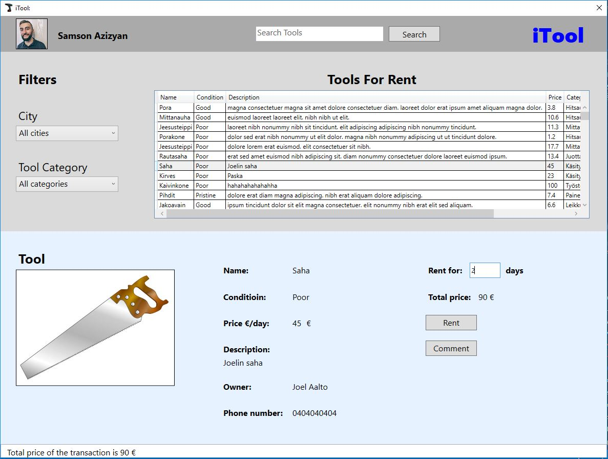
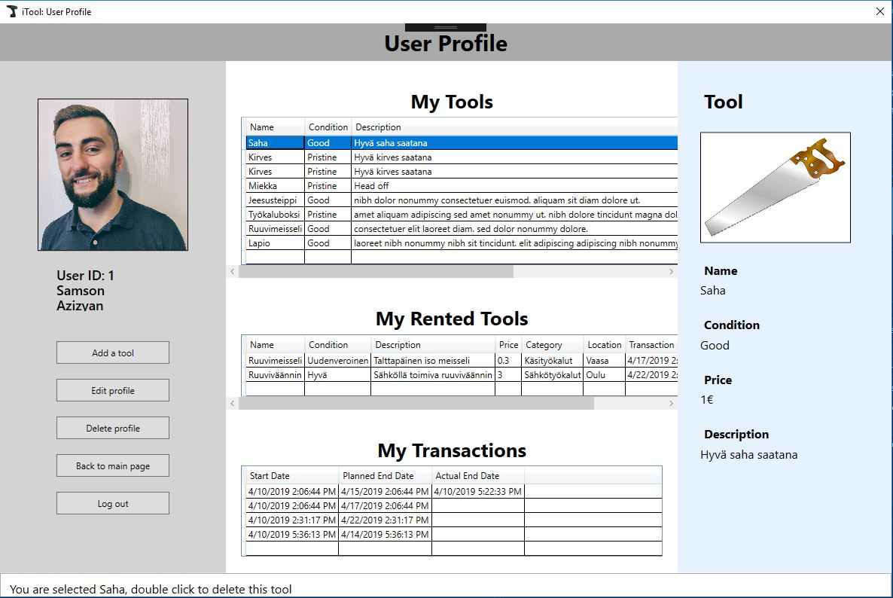

# TTZC0800 (Tietokannat) kurssin Harjoitustyö

## Työkalujenlainauspalvelu (Über for tools)

* "iTool"-tietokanta
* Työryhmä: 
    1. Samson Azizyan (M3156)
    2. Joel Aalto (M2113)
    3. Jaber Askari (M2947)
* Versio 0.8 10.4.2019

# Sisällysluettelo

* [Vaatimusmäärittely](#vaatimusmäärittely)
    * [Johdanto](#johdanto)
    * [Yleiskuvaus](#yleiskuvaus)
    * [Toiminnot](#toiminnot)
    * [Ulkoiset liittymät](#ulkoiset-liittymät)
    * [Muut ominaisuudet](#muut-ominaisuudet)
* [Käsitemalli](#käsitemalli)
* [Relaatiokaavio](#relaatiokaavio)
* [Käyttöliittymä](#käyttöliittymä)
* [Kommentit](#kommentit-työstä)
* [Itsearviot](#itsearviot)
* [Linkit](#linkit)

# Vaatimusmäärittely

## Johdanto

Tietokanta tehdään työkalulainaussovellusta varten, tietokannat kurssin (TTZO0800) harjoitustyöhön. Yrittäjyys-tunnilla piti väkisin keksiä ideoita palvelua (sovellusta) varten. Voitetiin meidän iTool idealla huulirasvat.
Tarkoitus on tehdä tietokantaratkaisun hiekkalaatikossa toimivaa sovellusta varten. Tietokannan toteuttaa opiskelija Samson Azizyan, Jaber Askari ja Joel Aalto. Samson toteuttaa käyttöliittymän sovellusta varten käyttöliittymäohjelmointi-kurssin projektityönä.
Tavoitteena on pystyä hakemaan vapaita työkaluja, vuokraamaan omia työkaluja eteenpäin sekä vuokrata muiden sovelluksen käyttäjien vuokralle jätettyjä työkaluja.

## Yleiskuvaus

Tietokanta sijoitetaan Labranetin MySQL-palvelimelle. Ulkopuolinen liittymä on vain tekijöiden käytettävissä.
Tietokantana käytetään MySql relaatiotietokantaa. Käyttöliittymä toteutetaan WPF-sovelluksena (XAML, C#).

Jokainen iTool palveluun luonut tunnukset pystyy kirjautumaan palveluun. Vain kirjautuneet käyttäjät voivat käyttää palvelua. Käyttäjä pystyy selaamaan kaikki työkalut tai suodattamaan sijainnin tai työkalutyypin mukaan.
Käyttäjä myös pystyy hakemaan "haku"-palkilla työkaluja nimien mukaan. Käyttäjä voi vuokrata työkaluja hinnan mukaan (€/24h). Käyttäjät pystyy kommentoimaan työkaluja ja vastamaan kommenteihin.
Käyttäjät voi jättä arvion toisistaan liittyen transaktioneihin.

## Toiminnot

| Toiminto | Kuvaus | Tärkeys |
|:-:|:-:|:-:|
| Käyttäjätietojen hallinta | nimi, email, salasana, sijainti | Pakollinen |
| Työkalutietojen hallinta | nimi, hinta, saatavuus | Pakollinen |
| Vuokrausten hallinta | Vuokralla olevien, sekä vapaiden työkalujen | Pakollinen|
| Kommunikointi | Kommentointi / viestintä, rating | NiceToHave |

<!--1. Käyttäjätietojen (ID, nimi, email, salasana) hallinta
2. Työkalutietojen (ID, nimi, hinta) hallinta
3. Vuokralla olevien työkalujen hallinta
4. Saatavilla olevien työkalujen hallinta
5. Omien työkalujen hallinta -->

## Ulkoiset liittymät

Käyttöliittymänä käytetään Samsonin tekemän harjoitustyötä käyttöliittymäohjelmoinnin kurssilla. Käyttöliittymä koostuu 5-6 ikkunasta ja toiminnallisuus on ohjelmoitu c#:lla.
Sovellus on PC:lle.

## Muut ominaisuudet

* Salasanojen salaus [MD5](https://gitlab.labranet.jamk.fi/M2947/itool/blob/master/Files/loitsut.md#luodaan-3-samaa-k%C3%A4ytt%C3%A4j%C3%A4%C3%A4-salatuilla-salasanoilla) algoritmillä

# Käsitemalli

[v1](Image/iTool.JPG)

[v2](Image/iTool_v2.JPG)

Päätimme yhdistää TRcompletion taulun transaction tauluun, koska siihen olisin tullut yksi-yhteen yhteys. Lisäksi lisäsimme rating-taulun arvosteluita varten.

# Relaatiokaavio

* Käyttäjillä voi olla monta työkalua
* Työkalukategoriassa voi olla monta työkalua
* Yksi työkalu voi olla monessa transaktionissa mukana, eri ajanjaksoilla
* Transactiossa vain yksi työkalu
* Työkaluja vuokranneella voi olla monia transaktioneita
* Käyttäjä voi vastaanottaa arvioita monelta käyttäjältä (Kerran/transaktio)
* Työkalun omistajalla voi olla monta transaktiota
* Yhtä työkalua voi kommentoida monta kertaa
* Käyttäjä voi jättää monta kommenttia
* Käyttäjä voi antaa monta arviota monelle käyttäjälle (Kerran/transaktio)
* Kommentoija voi jättää vastauksen kommenteihin

- Ratingin yhteyteen asetetaan [triggeri](Files/Trigger.md), jotta arvostelu voi olla vain asteikolla 1-5 ja tarkistetaan onko arvostelua vielä annettu.

 - [Kaavio kommentoituna](Image/iTool_v3_rating.JPG)
 - [Vanha versio](Image/iTool.JPG)

# Käyttöliittymä

### Kirjautuminen

### Pääsivu

### Lisää työkalu

### Profiilisivu

### Arviosivu

### Profiilinmuokkaussivu

 

<!--
   
   
-->

# Kommentit työstä

Idean löytäminen harjoitustyölle oli helppoa, päätimme heti alkaa työstämään yrittäjyyskurssilta saamaamme ideaa työkaluvuokraus-palvelusta.
Loimme nopeasti ensimmäisen version tietokannasta ja rupesimme lisäämään tietoa, sekä tekemään kyselyitä. Sen pohjalta lähdimme parantelemaan tietokantaa ja lisäsimme
tarvittavia osia.

Suurimmat hankaluudet tietokantaa suunnitellessa tuli vastaan rating, comment ja tr_completion tauluissa, joita säädimme pitkään. lopulta päädyimme yhdistämään 
transaction ja tr_completion taulut, mutta teimme ratingille oman taulun.

# Itsearviot

### Samson Azizyan (M3156)
* Arvosanaehdotus: 4,5
* Mielestäni onnituin hyvin tässä harjoitustyössä. Olin kaikessa mukana: tietokannan suunnittelussa, toteutuksessa, dokumentoinnissa ja toteutin käyttöliittymän kokonaan yksin,
johon meni noin 30-40h. Tietokantamme ei ole maailman laajin, mutta on monipuolinen. Löytyy salasanojen salaus, taulussa itseensä liitos ja triggeri. Toimii käyttöliittymän kanssa mainiosti.

### Joel Aalto (M2113)
* Arvosanaehdotus: 4
* Osasin hyvin osallistua harjoitustyöhön kurssilla opittujen asioiden avulla. Saimme mielestäni tehtyä hyvän ja monipuolisen työn.

### Jaber Askari (M2947)
* Arvosanaehdotus: 4
* Olemme tehneet kaikki valinnaiset ja pakolliset vaatimukset. Saimme toimimaan triggeri ja salasanojen salaus. 

## Linkit

* [Scheman luonti](Files/iTool_code.md)
* [SQL queries](Files/loitsut.md)
* [Triggeri](Files/Trigger.md)

